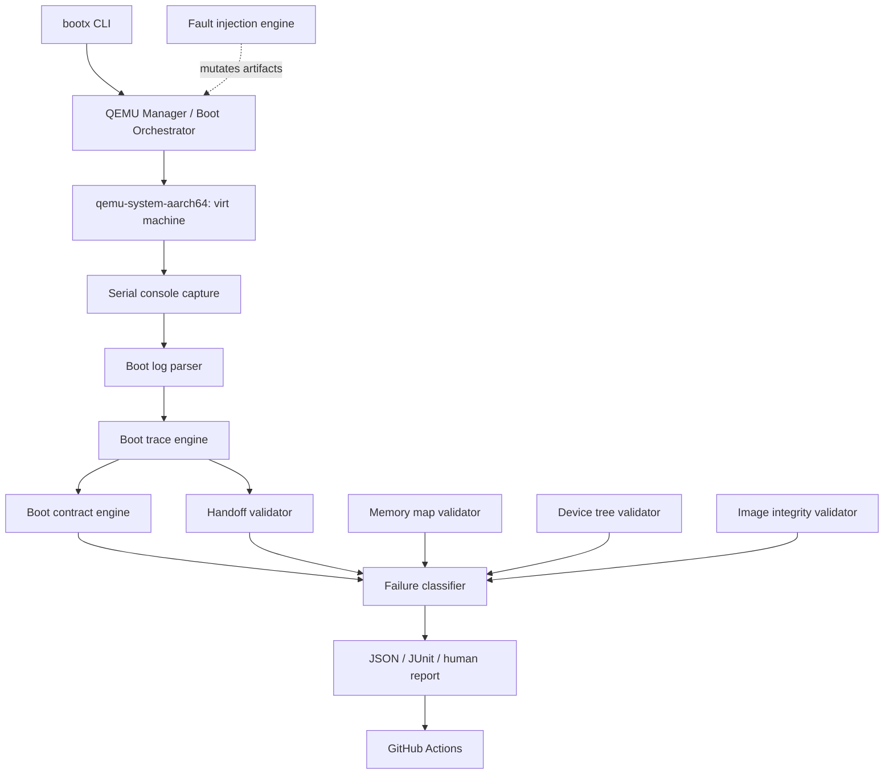
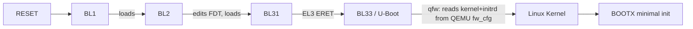

# BOOTX — ARM64 SoC Boot Firmware Validation & Fault-Injection Lab

BOOTX is a QEMU-based validation framework built around a **real
open-source ARM64 firmware stack** — Trusted Firmware-A, U-Boot, and
Linux — with structured boot tracing, contract-based pass/fail
validation, memory/device-tree/image integrity checking, controlled
fault injection, timeout/hang detection, evidence-driven failure
classification, and automated regression testing.

It is not a toy bootloader, not a simulation with hardcoded logs, and not
a claim of reproducing proprietary vendor firmware. See
[Limitations](docs/limitations.md) for exactly what is and isn't real here.

## Why BOOTX exists

Bootloader SDET work isn't "write firmware" — it's proving, repeatably
and automatically, that a multi-stage firmware boot behaves correctly
*and* fails predictably and diagnosably when something is wrong. BOOTX
was built to demonstrate that discipline end-to-end: a real ARM64 boot
chain, instrumented and tested the way a production validation team
would approach it, on hardware every reviewer can actually run.

## Problem statement

Given a real ARM64 firmware boot chain running under QEMU, build a
framework that can:

1. Launch the boot and capture every byte of firmware/kernel console
   output with host-relative timing, for every run, without exception.
2. Turn that raw output into structured, evidence-backed events and a
   timeline with stage-to-stage latency.
3. Declare, in a machine-checkable "boot contract," what a correct boot
   looks like — and fail loudly, with a specific diagnosis, when reality
   doesn't match.
4. Validate memory layout, device tree content, and firmware image
   integrity independently of whether the boot itself "worked."
5. Inject specific, controlled failures and prove the framework detects
   and correctly classifies each one — a fault test passes when the
   *detection* is correct, not when the boot merely breaks.
6. Do all of the above as an automated, CI-runnable regression suite
   with JUnit/JSON/human-readable reporting.

## Architecture



Full detail, including the hardware-portability rationale for the
test/runner boundary: [docs/architecture.md](docs/architecture.md).

## Boot flow



BL1/BL2/BL31 are TF-A's real `qemu`-platform code; BL33 is a real U-Boot
build. Every stage transition BOOTX reports is backed by a specific,
literal line of captured console output — see the evidence table in
[docs/boot-flow.md](docs/boot-flow.md).

## QEMU platform

BOOTX targets QEMU's **`virt`** ARM64 machine (`cortex-a72`, configurable
`-smp`/`-m`), QEMU's own generic paravirtual ARM64 platform — not any real
vendor silicon. See [Limitations](docs/limitations.md).

## Firmware stack

| Component | Version |
|---|---|
| Trusted Firmware-A | v2.15.0 |
| U-Boot | v2026.07 |
| Linux | v6.12 (LTS) |

Fetched by `make setup`; see [docs/boot-flow.md](docs/boot-flow.md) for
the exact build commands and flash-image layout.

## Test architecture

Unit-level tests (parser, contract engine, memory/DTB/image validators)
run with no QEMU boot required; end-to-end tests run real boots and skip
cleanly (not fail) when firmware hasn't been built. Full detail:
[docs/testing-strategy.md](docs/testing-strategy.md).

```sh
pytest                  # everything runnable on this host right now
pytest -m smoke          # fast sanity subset
pytest -m fault           # fault-injection tests
pytest -m smp              # -smp 1/2/4/8 parameterized boots
pytest -m regression        # full end-to-end suite (needs built firmware)
```

**Last verified run** (real hardware evidence, not estimated): full
suite, 58 items, **58 passed / 0 failed / 0 skipped**, ~110s, against a
real built TF-A v2.15.0 + U-Boot v2026.07 + Linux v6.12 stack on QEMU
`virt` (`-smp 1/2/4/8`, `-m 2048`). See
[docs/resume-bullets.md](docs/resume-bullets.md) for every claim traced
to its source file and proving test, including three real bugs found and
fixed along the way (not a clean first pass).

## Boot contracts

A boot contract (`scenarios/*.yaml`) declares required stages, their
order, required events, and a timeout budget; `bootx/validation/boot_contract.py`
evaluates a real captured `BootTimeline` against it:

```
BOOT CONTRACT

[PASS] BL31_ENTRY detected
[PASS] BL33_ENTRY detected
[PASS] KERNEL_ENTRY detected
[PASS] order BL31_ENTRY -> BL33_ENTRY -> KERNEL_ENTRY -> USERSPACE_READY holds
[PASS] DTB_LOADED detected
[PASS] boot finished within 15000ms budget

CONTRACT RESULT: PASS
```

## Fault injection

Every fault mutates a real, working artifact/config in a controlled,
reversible way and is scored PASS only when BOOTX's own classifier
correctly detects and categorizes the resulting failure. Full treatment:
[docs/fault-injection.md](docs/fault-injection.md).

| Fault | Expected category |
|---|---|
| `corrupt_image` | `IMAGE_FAILURE` |
| `invalid_dtb` / `missing_dtb` | `DTB_FAILURE` |
| overlapping / out-of-range / misaligned regions | `MEMORY_FAILURE` |
| `boot_timeout` | `TIMEOUT_FAILURE` |
| `invalid_bootargs` / `missing_kernel` | `CONFIGURATION_FAILURE` |

## Validation areas

Boot contract · memory map · device tree · firmware image integrity ·
stage handoff timing · PSCI (`SYSTEM_OFF`, `CPU_ON` via SMP) · EL3 exit
SPSR observation · timeout/hang detection · boot performance.

See [docs/interview-guide.md](docs/interview-guide.md) for how each of
these maps to a real bootloader-engineering concept, what BOOTX actually
implements, and what its limits are.

## Performance methodology

BOOTX measures real, repeated QEMU boots and reports min/max/mean/median
per stage-to-stage latency (`bootx/performance/boot_metrics.py`). This is
**host wall-clock time observed by the harness**, useful for catching
regressions in this exact configuration on this exact host — it is
explicitly **not** representative of real physical hardware boot timing.
Full explanation: [docs/limitations.md](docs/limitations.md).

## CI

`.github/workflows/ci.yml` runs a fast QEMU-independent unit-test lane on
every push, and a slower firmware-build-and-regression lane with cached
build artifacts. No physical hardware is required anywhere in CI.

## Limitations

Read this before reading anything else in this repository:
[docs/limitations.md](docs/limitations.md). Short version: QEMU `virt` is
not real silicon, no proprietary vendor firmware is implemented, timing
is QEMU/host-observed rather than silicon-accurate, secure-world
observability is partial and explicitly documented, and image integrity
checking is a BOOTX-authored educational layer, not production secure
boot.

## Setup

```sh
git clone <this-repo>
cd bootx
make setup    # python venv + bootx package (editable install)
make build    # fetch/build TF-A + U-Boot + Linux + initramfs (needs apt deps below)
```

Host dependencies (Ubuntu 22.04 / WSL2):

```sh
sudo apt-get install -y \
  qemu-system-arm qemu-utils \
  gcc-aarch64-linux-gnu g++-aarch64-linux-gnu \
  device-tree-compiler \
  build-essential bc bison flex libssl-dev libelf-dev \
  cpio rsync python3-pip python3-venv unzip
```

`bootx doctor` checks all of this and reports exactly what's missing.

## Usage

```sh
bootx doctor              # check host tooling + build artifacts
bootx build                # build the firmware stack
bootx boot                 # run one boot, print the trace
bootx test -m smoke         # run the pytest suite (optionally filtered)
bootx report                 # render the latest JUnit result
bootx clean                   # remove build outputs and run artifacts
```

## Repository structure

```
bootx/            Python framework (orchestrator, tracing, validation, faults, analysis, performance, reporting, CLI)
tests/             pytest suite
scenarios/          boot contracts (YAML)
firmware/             TF-A / U-Boot / Linux build scripts + sources (gitignored)
qemu/                  launch script, build scripts, built images (gitignored)
docs/                    architecture, boot-flow, testing, fault-injection, limitations, interview guide
reports/                  JUnit/JSON reports and per-run artifact directories
dashboard/                 Next.js live dashboard (reads reports/ directly, no separate backend)
.github/workflows/         CI
```

## Dashboard

A live Next.js + TypeScript + Tailwind dashboard (`dashboard/`) visualizes
everything above: a real-time boot trace timeline (color-coded per stage,
raw evidence line on expand), SMP/PSCI evidence per CPU count, fault
detection status, categorized test results, boot performance charts, and
full run history — all read directly off `reports/` and `qemu/images/`
(server-side `fs` reads, no database, no mocked data). A "LIVE" indicator
polls for an active `qemu-system-aarch64` process and tails its log in
real time while a boot is running.

```sh
cd dashboard
npm install
npm run dev   # http://localhost:3000
```

Chart colors use a categorical palette validated for colorblind-safe
adjacent-pair separation via the project's palette validator against this
dashboard's actual dark surface color (see `app/globals.css`).

## Future work

- Physical-hardware backend (serial/JTAG transport, board power control)
  behind the same `BootTimeline` abstraction — see
  [docs/architecture.md](docs/architecture.md).
- Deeper PSCI coverage (`CPU_OFF`, `SYSTEM_RESET`).
- EL2/EL1 transition observability via kernel/U-Boot instrumentation or a
  QEMU GDB-stub session.
- Physical-board backends for the dashboard's live indicator (currently
  detects an active `qemu-system-aarch64` process; a hardware runner would
  need its own liveness signal).
