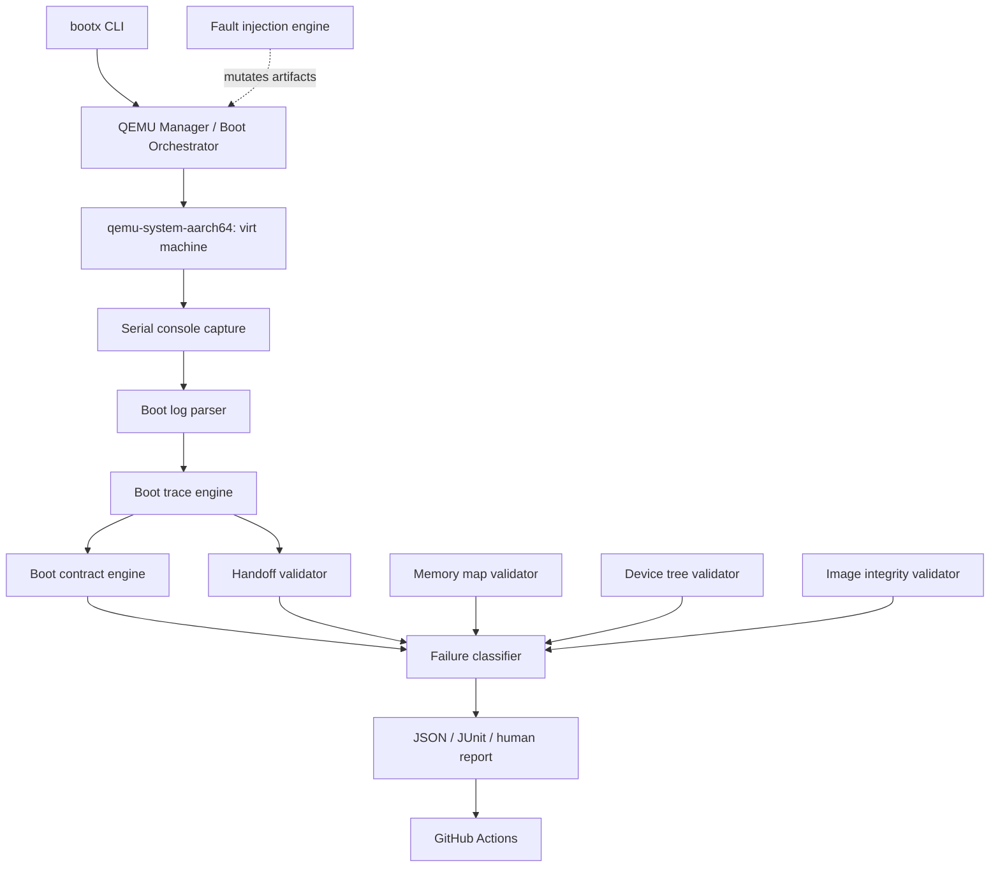
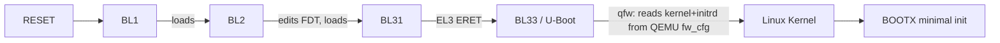

# Architecture

## System diagram



## Real boot chain executed inside QEMU



BL1/BL2/BL31 are TF-A's real `qemu` platform code; BL33 is a real U-Boot
build (`qemu_arm64_defconfig`). See `docs/boot-flow.md` for exactly how
each stage's completion is detected, and `docs/limitations.md` for what
QEMU's `virt` machine does *not* represent.

## Module layout

| Layer | Package | Responsibility |
|---|---|---|
| Orchestration | `bootx/orchestrator/` | QEMU process lifecycle, run-directory management, high-level `BootRunner` |
| Tracing | `bootx/tracing/` | Event model, log parser, timeline/latency computation |
| Validation | `bootx/validation/` | Boot contract engine, memory/DTB/image/handoff/EL validators |
| Faults | `bootx/faults/` | Controlled, reversible artifact/config mutation for negative testing |
| Analysis | `bootx/analysis/` | Evidence-driven failure classification |
| Performance | `bootx/performance/` | Multi-iteration boot timing statistics |
| Reporting | `bootx/reporting/` | JUnit XML + human-readable + JSON reports |
| CLI | `bootx/cli/` | `bootx doctor/build/boot/test/report/clean` |

## Why the test/runner boundary matters (hardware portability)

Every validator and the contract/handoff/classification engines operate
on a `BootTimeline` -- a list of `BootEvent`s with timestamps -- not on
QEMU internals directly. The only two places that know QEMU exists are
`bootx/orchestrator/qemu.py` (process lifecycle) and
`bootx/orchestrator/config.py` (how to build a QEMU command line). A
physical-hardware backend would replace those two modules (serial/JTAG
transport, board power control, hardware-specific log capture) and
produce the same `BootEvent`/`BootTimeline` shape; every validator,
the contract engine, the fault classifier, and all of `bootx/reporting`
would be unchanged. See `docs/interview-guide.md` for further discussion.

## Data flow per run

Every boot run gets its own directory under `reports/runs/<timestamp>_<label>/`:

```
reports/runs/20260918_010203_123456_pytest/
    qemu.log        raw serial console output (never discarded)
    metadata.json   command line, config, host info, firmware versions
    events.json     parsed BootEvent list
    result.json     timeline + stage latencies + QEMU exit info
```

This is deliberate: a failed test must be diagnosable without a rerun.
`docs/testing-strategy.md` covers how this is used in practice.
